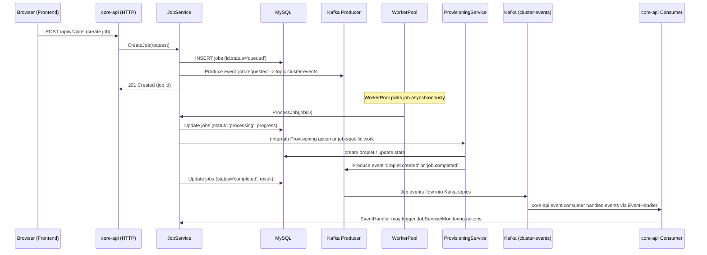

# ClusterGenie — Low-Level Design (LLD)

This document breaks the system down into internal components and detailed data paths so engineers can implement, test, and operate ClusterGenie.

## Contents
- Backend internal architecture (services, repos, workers)
- Rate limiter internals (TokenBucket, Redis-backed implementation)
- Job processing flow (sequence diagram for create → process → complete)
- Event pipeline (Kafka topic naming + consumer/producer responsibilities)
- Monitoring/logging pipeline (Prometheus, Loki, log-consumer)
- Storage schema highlights (from migrations)

---

## Backend (core-api) component breakdown

```mermaid
flowchart TD
  API[HTTP REST API (Gin)]
  DB[MySQL Database]
  RDS[Redis]
  Kafka[(Kafka)]
  Producer[Kafka Producer]
  Consumer[Kafka Consumer]
  Worker[WorkerPool]
  Limiter[LimiterManager]
  Services[Domain Services]
  Repos[Repositories]
  EventHandler[EventHandler]

  API --> Services
  Services --> Repos
  Repos --> DB
  Repos --> RDS
  Services --> Producer
  Consumer --> EventHandler
  EventHandler --> Services
  Services --> Worker
  Worker --> Services
  API --> Limiter
  Limiter --> RDS
  Services -->|metrics| Prometheus[[Prometheus]]

  subgraph Domain [Services]
    ProvisioningSvc[ProvisioningService]
    JobSvc[JobService]
    ClusterSvc[ClusterService]
    DiagnosisSvc[DiagnosisService]
    AutoscalerSvc[AutoscalerService]
    MonitoringSvc[MonitoringService]
  end

  Services --> ProvisioningSvc
  Services --> JobSvc
  Services --> ClusterSvc
  Services --> DiagnosisSvc
  Services --> AutoscalerSvc
  Services --> MonitoringSvc
```

ASCII version: `docs/architecture/diagrams/LLD_component_ascii.txt` (plain-text component diagram)

Notes:
- `Repositories` are thin wrappers to persist and retrieve `clusters`, `droplets`, `jobs` and `metrics` using MySQL and caching/persistence via Redis.
- `WorkerPool` is used by `JobService` to offload long-running job processing to background goroutines; it exposes queue snapshot counts used by Prometheus.
- `LimiterManager` provides scoped rate limiting for routes and uses an in-memory `TokenBucket` or a `RedisTokenBucket` backed by a Lua script for atomic operations across instances.

---

## Rate-limiter internals

Key concepts implemented in `services/limiter.go`:

- TokenBucket (in-memory): refillRate tokens per second; capacity maximum tokens. Allow() deducts tokens atomically (protected by mutex in-memory).
- RedisTokenBucket: stores state in Redis and runs an atomic Lua script to update tokens (ensures cross-process concurrency correctness).
- LimiterManager: maintains named buckets and supports `GetOrCreate(name, scope)` to create per-scope buckets (e.g. user:123 or cluster:abc) and falls back to default config stored in Redis (keys like `limiter_config:<name>:<scope>`).

Observability:
- `services/metrics.go` exposes Prometheus metrics:
  - clustergenie_rate_limit_exceeded_total (Counter)
  - clustergenie_rate_limit_available_tokens (GaugeVec)

API Interaction:
- Middleware (middleware.RateLimitMiddlewareXXX) queries LimiterManager.Allow and returns HTTP 429 on denial.
- Observability endpoints: `/observability/ratelimit` and `/observability/ratelimit/config` allow querying and persisting limiter config.

---

## Job flow — sequence diagram

This shows the path from user creating a job through processing, event emission, and completion.



Notes:
- Kafka is used for eventual consistency and for decoupling producers (API) from consumers (backend event handlers, log pipeline, etc.).
- Events use structured JSON payloads including job_id and trace_id to enable observability and correlation.

---

## Logging & log processing

- Application logs are written in JSON format and include keys like `service`, `environment`, `level`, `timestamp`, `job_id`, `trace_id`.
- In the local/dev flow, logs are also emitted into Kafka topic `logs.*`.
- A separate `log-consumer` service consumes Kafka log topic(s) and pushes structured streams to Loki with labels `service`, `env`, `level`, `job_id`, `trace_id`.
- Grafana is configured with a Loki datasource and dashboards that allow clicking logs to pre-populate `job_id`/`trace_id` for correlation.

---

## Monitoring pipeline

- core-api exposes Prometheus metrics at `/metrics` and registers custom gauges/counters (worker pool metrics, rate limiter states, HTTP request metrics).
- A periodic exporter converts DB-stored metrics (backend metrics table) into Prometheus gauges.
- Prometheus scrapes `/metrics` and stores the time series.
- Grafana reads Prometheus (metrics) and Loki (logs) and provides dashboards; dashboards are pre-provisioned in the repo under `monitoring/grafana/dashboards`.

---

## Storage / DB schema highlights

From `database/migrations/000001_init.up.sql`:
- clusters (id, name, region, droplets JSON, status, last_checked)
- droplets (id, cluster_id, name, region, provider, size, image, status, created_at, ip_address)
- jobs (id, cluster_id, type, status, trace_id, progress, created_at, completed_at, result, error, parameters JSON)
- metrics (id, cluster_id, type, timestamp, value, unit)

This schema supports the main domain objects used by services. Repositories enforce the DB <-> models translation.

---

## Observability endpoints & runtime state

- `/metrics` — Prometheus scrape endpoint
- `/observability/ratelimit{, /config, /config/list}` — limiter management and status
- `/observability/workerpool` — worker pool status (counts/queue snapshot)

These endpoints are secured in dev by default network isolation; in production you'd add authentication / RBAC.

---

## Security & operational considerations (LLD)
- Authentication/Authorization: Currently not present in codebase; `X-User-ID` used to scope rate limits and routing but not as an auth mechanism.
- Input validation: Services and handlers include basic validation; additional hardening recommended (size limits, input sanitization) before production deployment.
- Multi-instance coordination: Redis-backed limiter ensures consistent rate limits across instances; Kafka ensures event durability.
- Graceful shutdown: `main.go` uses defer on several resources and starts goroutines — verify shutdown ordering in heavy load.

---

## Next step
I will create diagram image snippets (mermaid files) and add the files into the repo under `docs/architecture/diagrams` along with a short README explaining how to preview them locally (Mermaid preview / GitHub rendering). 

