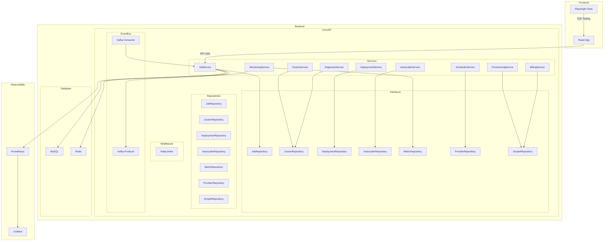

    

    <b>Automatic Architecture Diagrams from Code</b> 
    <a href="https://github.com/swark-io/swark">GitHub</a> • <a href="https://swark.io">Website</a> • <a href="mailto:contact@swark.io">Contact Us</a>

## Usage Instructions

1. **Render the Diagram**: Use the links below to open it in Mermaid Live Editor, or install the [Mermaid Support](https://marketplace.visualstudio.com/items?itemName=bierner.markdown-mermaid) extension.
2. **Recommended Model**: If available for you, use `claude-3.5-sonnet` [language model](vscode://settings/swark.languageModel). It can process more files and generates better diagrams.
3. **Iterate for Best Results**: Language models are non-deterministic. Generate the diagram multiple times and choose the best result.

## Generated Content
**Model**: GPT-4o - [Change Model](vscode://settings/swark.languageModel)  
**Mermaid Live Editor**: [View](https://mermaid.live/view#pako:eNqlVV1zojAU_StMntsH8Kv1YWdUqLJbZ13tW_DhClEzDYRJgh2m9r9vNKwVRWRm83a4h8PNucfrJwp5RFAfBclGQLq13twgsfSR2co8eBE8USSJzOPDGeAZg_xD0M1WWW9EKrm0Hh9_7D3HO0KabPbWEM8JhMoapOnSvHrUuBAfQvhe0j5VRlyQwcz_rpSqvm5JrCEkskw4nJGNf_LVnKRcUsVFvqygOHjEMqk16mkt7JKU8TwmiapntvEgU1yGwO5pdvCUKEHDelYXzwTf0eieWg-7gqeM3G6vZG_JxAURO1ppoXu0sKhXfNY9-VfDaZkrSMoTnYga4rl3NTRtnFbSN6xX6-JFuCVRVi-mfaOwSbRlsob1dDb_GtozHlLGbrZ1ewKnodGqKXj3g-w1C7LXOMhe4yB7jYLsNQyy9z9BntIoYuQDBLkWfrHxHBR5pTHVLjWW9HbaqWFWMZWxjX_B-h0sfa8oC680jxyn4Ix4IrO4_rvV-88FBSuQFzea2HiaL_68XuhNHL1tIyqXFapVa_f3SuqkwooyqvLvd3z7MKyYqC3JzrV8B48FrCGB61U-PK5-vamtETAm93p3mIJrHyp6GxfQMdApYMvAXgHbBrYL2DGwU8Cugd0C9spSTwa2CvhcVjZtjIs2xqaNiyYnF9ApteEXVd9UfV1FD0hPNQYa6b_OzwBpx2ISoL4VoIisIWMqQF-alKWRDt9h1QiIUV-JjDwg0D-wRZ6E_7Dg2WaL-mtgknz9BV2KFJg) | [Edit](https://mermaid.live/edit#pako:eNqlVV1zojAU_StMntsH8Kv1YWdUqLJbZ13tW_DhClEzDYRJgh2m9r9vNKwVRWRm83a4h8PNucfrJwp5RFAfBclGQLq13twgsfSR2co8eBE8USSJzOPDGeAZg_xD0M1WWW9EKrm0Hh9_7D3HO0KabPbWEM8JhMoapOnSvHrUuBAfQvhe0j5VRlyQwcz_rpSqvm5JrCEkskw4nJGNf_LVnKRcUsVFvqygOHjEMqk16mkt7JKU8TwmiapntvEgU1yGwO5pdvCUKEHDelYXzwTf0eieWg-7gqeM3G6vZG_JxAURO1ppoXu0sKhXfNY9-VfDaZkrSMoTnYga4rl3NTRtnFbSN6xX6-JFuCVRVi-mfaOwSbRlsob1dDb_GtozHlLGbrZ1ewKnodGqKXj3g-w1C7LXOMhe4yB7jYLsNQyy9z9BntIoYuQDBLkWfrHxHBR5pTHVLjWW9HbaqWFWMZWxjX_B-h0sfa8oC680jxyn4Ix4IrO4_rvV-88FBSuQFzea2HiaL_68XuhNHL1tIyqXFapVa_f3SuqkwooyqvLvd3z7MKyYqC3JzrV8B48FrCGB61U-PK5-vamtETAm93p3mIJrHyp6GxfQMdApYMvAXgHbBrYL2DGwU8Cugd0C9spSTwa2CvhcVjZtjIs2xqaNiyYnF9ApteEXVd9UfV1FD0hPNQYa6b_OzwBpx2ISoL4VoIisIWMqQF-alKWRDt9h1QiIUV-JjDwg0D-wRZ6E_7Dg2WaL-mtgknz9BV2KFJg)

