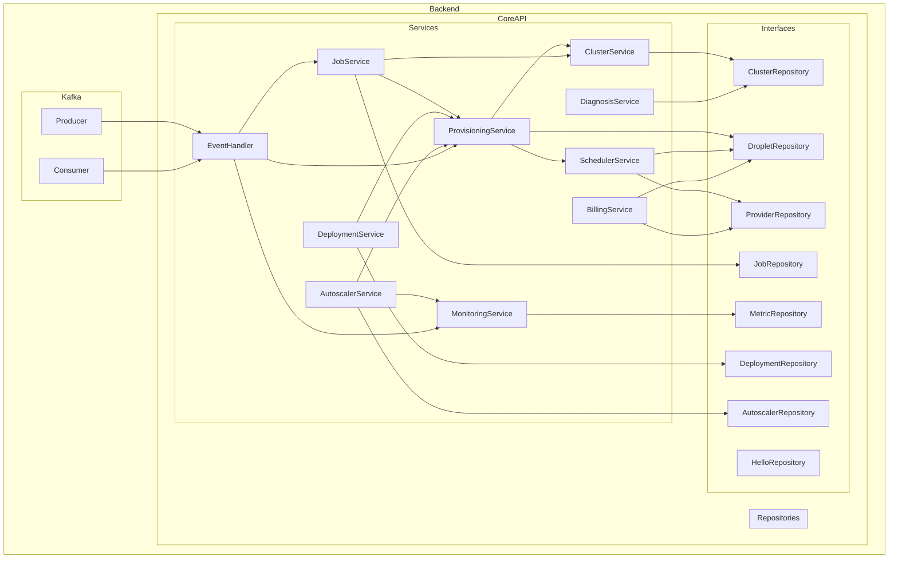

    

    <b>Automatic Architecture Diagrams from Code</b> 
    <a href="https://github.com/swark-io/swark">GitHub</a> • <a href="https://swark.io">Website</a> • <a href="mailto:contact@swark.io">Contact Us</a>

## Usage Instructions

1. **Render the Diagram**: Use the links below to open it in Mermaid Live Editor, or install the [Mermaid Support](https://marketplace.visualstudio.com/items?itemName=bierner.markdown-mermaid) extension.
2. **Recommended Model**: If available for you, use `claude-3.5-sonnet` [language model](vscode://settings/swark.languageModel). It can process more files and generates better diagrams.
3. **Iterate for Best Results**: Language models are non-deterministic. Generate the diagram multiple times and choose the best result.

## Generated Content
**Model**: GPT-4o - [Change Model](vscode://settings/swark.languageModel)  
**Mermaid Live Editor**: [View](https://mermaid.live/view#pako:eNrtVsluwjAQ_ZXIZ_iBHCoBqQStkFDpMRcTTxILx468ICHEv9cE0sRkM-q1uWXmvVmeZ5xcUCIIoBDFPJO4zIPvKOaBfZQ53A1LnByBk7vV8ayEhMVu03gc74ZrkClOQLmA2_MhDl9QCkW1kOeuO4KSiXMBXI-hVswom2IMsjBaqASzcVQkRclgNNcWtKTJGGInxYmS8URrYEwMARyNHSX3IE-0V8eHBA9AMJ-_-ahSlaqo4JRnbaqHDkNUtxB_3j7JgRg2wnxGVDQfsXuJHi3a2WwzJkb1Cd3T5yRnSruI4ozbAtSLx7y1VVjPk-LTk9xsn6Oc1072c71UaXa1TfXb4H7uH9J2tOsSl5Sx1xeoh-UzzO8nK-kac2LrrMdysLIO2KObDmdSvOH76rcR-n_3d6Xq_5Z-4vSIXZaNSkwC0rWuBFemaFudgDWpOsP2oTaQOsIApAqHZsgiCkyJ_TW4xEjnUECMwiBGBFJsmI7R1YJMSbCG2w0lcYFCLQ3MELbK7888qd-lMFmOwhQzBdcf0r2AZw) | [Edit](https://mermaid.live/edit#pako:eNrtVsluwjAQ_ZXIZ_iBHCoBqQStkFDpMRcTTxILx468ICHEv9cE0sRkM-q1uWXmvVmeZ5xcUCIIoBDFPJO4zIPvKOaBfZQ53A1LnByBk7vV8ayEhMVu03gc74ZrkClOQLmA2_MhDl9QCkW1kOeuO4KSiXMBXI-hVswom2IMsjBaqASzcVQkRclgNNcWtKTJGGInxYmS8URrYEwMARyNHSX3IE-0V8eHBA9AMJ-_-ahSlaqo4JRnbaqHDkNUtxB_3j7JgRg2wnxGVDQfsXuJHi3a2WwzJkb1Cd3T5yRnSruI4ozbAtSLx7y1VVjPk-LTk9xsn6Oc1072c71UaXa1TfXb4H7uH9J2tOsSl5Sx1xeoh-UzzO8nK-kac2LrrMdysLIO2KObDmdSvOH76rcR-n_3d6Xq_5Z-4vSIXZaNSkwC0rWuBFemaFudgDWpOsP2oTaQOsIApAqHZsgiCkyJ_TW4xEjnUECMwiBGBFJsmI7R1YJMSbCG2w0lcYFCLQ3MELbK7888qd-lMFmOwhQzBdcf0r2AZw)

