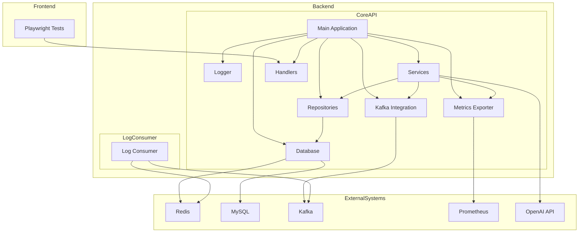

    

    <b>Automatic Architecture Diagrams from Code</b> 
    <a href="https://github.com/swark-io/swark">GitHub</a> • <a href="https://swark.io">Website</a> • <a href="mailto:contact@swark.io">Contact Us</a>

## Usage Instructions

1. **Render the Diagram**: Use the links below to open it in Mermaid Live Editor, or install the [Mermaid Support](https://marketplace.visualstudio.com/items?itemName=bierner.markdown-mermaid) extension.
2. **Recommended Model**: If available for you, use `claude-3.5-sonnet` [language model](vscode://settings/swark.languageModel). It can process more files and generates better diagrams.
3. **Iterate for Best Results**: Language models are non-deterministic. Generate the diagram multiple times and choose the best result.

## Generated Content
**Model**: GPT-4o - [Change Model](vscode://settings/swark.languageModel)  
**Mermaid Live Editor**: [View](https://mermaid.live/view#pako:eNqNlM9SwjAQxl8lk7O8AAdnEHRklBHFW-phbZeSsU06Saoyju9umhAIJVRyyJ_dX0L3yxd-aC4LpGOaiVJBsyGvs0wQ23T77gN3SgqDovDhri0r2H4pXm7MK2qj2WFNXODNo25P77AbyD-OztpnplLhZDk_ZLq2Cy6AC9Z1ZNI0Fc_BcCnekuijLEtUzA9pZAYG3kEjC5M09oKN1NxIxVGzeJHGV6g-eW7RMElj9yCKCpVmYZLGHmD9Acz1ZG7ltxqdr3mBRvFcs91Ibr8bqcxR-dFdHKludZpKodsa1fHRUcKpb9ckBPrnnrvs22_7EQKq1VYbrPVh1wsWvNPU9tFZi-3q-ZG5PopGSkTRpZI1mg221n37aZR_alBM5swPxGp06smei8lodN2_JA9GJowhb7FBJBhsEIqtNQgGYw1CF326U3OQ2FkpaNWrx5Huos6n3e329sel_qtTKPcirVLwaZUpal_pOc57qFeJf5ldOvqV3pu5JJ1SKTzjLn8wdyboFbVba-CF_bv-yagN15jRMclogWtoK5PRXwu1TQEGZxzsK6zp2KgWryi0Rq62Ig9rJdtyQ8drqDT-_gF8E-gb) | [Edit](https://mermaid.live/edit#pako:eNqNlM9SwjAQxl8lk7O8AAdnEHRklBHFW-phbZeSsU06Saoyju9umhAIJVRyyJ_dX0L3yxd-aC4LpGOaiVJBsyGvs0wQ23T77gN3SgqDovDhri0r2H4pXm7MK2qj2WFNXODNo25P77AbyD-OztpnplLhZDk_ZLq2Cy6AC9Z1ZNI0Fc_BcCnekuijLEtUzA9pZAYG3kEjC5M09oKN1NxIxVGzeJHGV6g-eW7RMElj9yCKCpVmYZLGHmD9Acz1ZG7ltxqdr3mBRvFcs91Ibr8bqcxR-dFdHKludZpKodsa1fHRUcKpb9ckBPrnnrvs22_7EQKq1VYbrPVh1wsWvNPU9tFZi-3q-ZG5PopGSkTRpZI1mg221n37aZR_alBM5swPxGp06smei8lodN2_JA9GJowhb7FBJBhsEIqtNQgGYw1CF326U3OQ2FkpaNWrx5Huos6n3e329sel_qtTKPcirVLwaZUpal_pOc57qFeJf5ldOvqV3pu5JJ1SKTzjLn8wdyboFbVba-CF_bv-yagN15jRMclogWtoK5PRXwu1TQEGZxzsK6zp2KgWryi0Rq62Ig9rJdtyQ8drqDT-_gF8E-gb)

